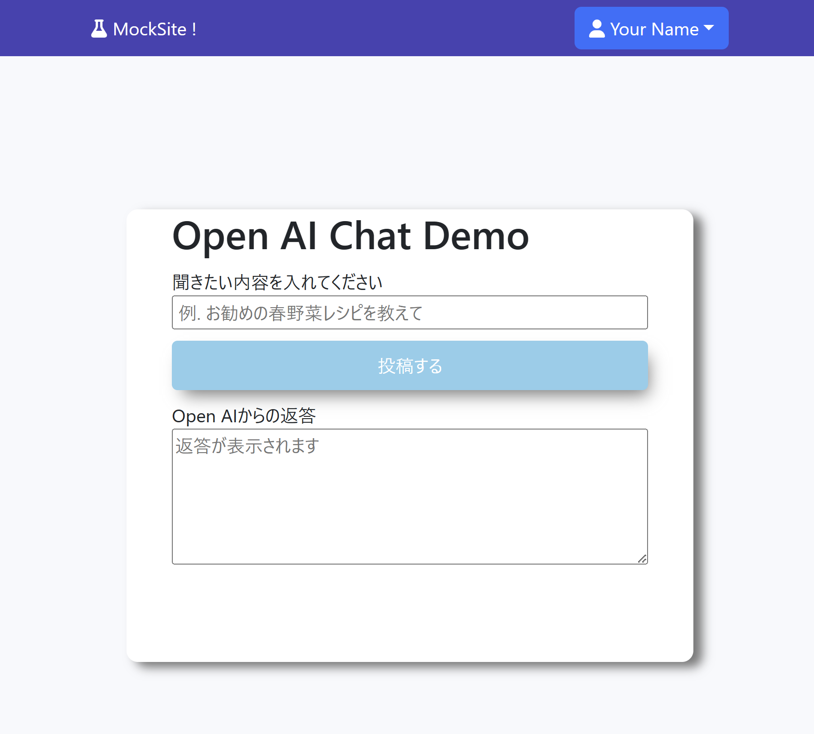
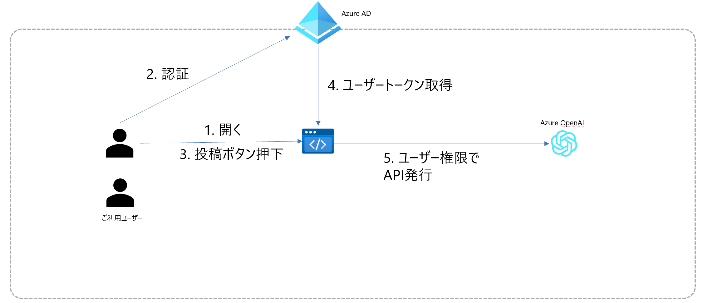

English follows

# このリポジトリについて



* このリポジトリはAzure AD認証に基づいてAzure Open AIを叩くAPIのreactで実装されたデモです

* Azure ADで認証したログインのユーザーの権限でAzure Open AIを利用します

# 構成概要



# 環境: 

* nodejs 16以上
* npm 8以上

# 利用方法

## Azure上の準備

### 1. AzureADでアプリの登録

Azureポータルにログインし、「アプリの登録」> 「新規登録」
任意の名前を付け、サポートされているアカウントの種類でシングルテナントを選択します。
リダイレクトURIでは種類でSPAを選択し、ローカルで動かす場合はhttp://localhost:3000、リモートサーバ上で動かす場合には適宜そのサーバのドメインを指定します。

### 2. 登録アプリへのAPIのアクセス許可追加

登録されたアプリを選択し、「APIのアクセス許可」を選択します。「＋アクセス許可の追加」を選択し「Microsoft Cognitive Service」- 「user impersonation」を選択します。

追加が完了したら、「(テナント名)に管理者の同意を与えます」を必ず押下してください。
（Azure ADの管理者権限が必要です）

### 3. Azure Open AIのデプロイ

適当なリソースグループを作成し、Azure Open AIをデプロイします。
「名前」で指定した値がサブドメインとして必要になるので適宜メモしてください。
NetworkタブのTypeとして "All networks, including the internet, can access this resource." を選択します。（VNet等経由でアクセスさせたい方は適宜選択してください）
デプロイ完了まで15分程度を要します。

※ 現時点ではAzure Open AIのご利用には申請が必要です

### 4. Azure Open AIモデルのデプロイ

Azure Open AIが作成されたら、次はモデルのデプロイを行います。作成されたAzure Open AIを選択し、「モデル デプロイ」＞「作成」を選択してください。
モデルは何でも構いませんが、ここでは「gpt-35-turbo」を選択するものとします。

指定したモデルデプロイ名を後ほど設定で使います。

### 5. ロールの付与

当サンプルにログインして操作したいユーザーには「Cognitive Service Open AI User」ロールが必要となります。（）
Azure Open AIの「アクセス制御 (IAM)」から付与を行ってください。

ここまででAzure上の準備は完了です。

## ご利用方法

1. 本リポジトリをClone後、.envファイルを以下のように適宜環境に合わせて書き換えてください。

|  変数名  |  変数の内容 |
| ---- | ---- |
|REACT_APP_CLIENT_ID  |Azure ADに登録したアプリのクライアントID  |
|REACT_APP_TENANT_ID  |Azure ADのディレクトリ(テナント)ID  |
|REACT_APP_REDIRECT_URL  |リダイレクト先に指定したURL  |
|REACT_APP_OPEN_AI_SUBDOMAIN  |Azure OpenAIに指定した名前(=サブドメイン)  |
|REACT_APP_OPEN_AI_MODEL_NAME  |デプロイしたモデルの名前(選択したモデル名ではなく自分でつけた名前)  |
|REACT_APP_OPEN_AI_API_VERSION  |Azure OpenAIのAPIバージョン  |


2. パッケージのインストール

```bash
npm install
```

3. 起動

```bash
npm start
```

# その他

* 手順通りにやったけど動かない等の困りごとはお気軽にIssueまで
* 本リポジトリの内容は個人的な見解であり、所属する会社、組織とは全く関係ありません
* 当リポジトリの内容は保証/責任は一切負いません。自己責任でご利用ください


-------------

-----
# About this Repository


* This repository is a demo implemented in React that calls the Azure Open AI API based on Azure AD authentication.

# Architecture Overview


# Environment:

* Node.js 16 or higher
* npm 8 or higher

# Usage

## Preparations on Azure

### 1. Register an app in Azure AD

Log in to the Azure portal, go to "App registrations" > "New registration". Give it a name and select "Single tenant" for the supported account types. For the Redirect URI, choose "SPA" and specify "http://localhost:3000" if running locally or the appropriate server domain for remote servers.

### 2. Add API permissions to the registered app

Select the registered app and click on "API permissions". Choose "+ Add a permission" and select "Microsoft Cognitive Service" > "user impersonation".

Once added, be sure to click on "Grant admin consent for (Tenant Name)".
(Azure AD admin privileges are required)

### 3. Deploy Azure Open AI

Create a suitable resource group and deploy Azure Open AI. Note down the name specified as it will be needed as the subdomain later. Choose "All networks, including the internet, can access this resource." for the Network Type. (Select the appropriate option if you want access via VNet, etc.)
Deployment takes about 15 minutes.

* At this time, an application is required to use Azure Open AI.

### 4. Deploy Azure Open AI model

Once Azure Open AI is created, deploy the model. Select the created Azure Open AI, then go to "Model Deployment" > "Create". You can choose any model, but for this example, we will select "gpt-35-turbo".

The model deployment name specified will be used in the configuration later.

### 5. Assign roles

Users who want to log in and use this sample need the "Cognitive Service Open AI User" role. Assign it from the "Access control (IAM)" of the Azure Open AI.

With this, the preparations on Azure are complete.

## How to use

1. After cloning this repository, update the .env file according to your environment:

|  Variable Name  |  Variable Content |
| ---- | ---- |
|REACT_APP_CLIENT_ID  |Client ID of the app registered in Azure AD  |
|REACT_APP_TENANT_ID  |Directory (Tenant) ID of Azure AD  |
|REACT_APP_REDIRECT_URL  |URL specified as redirect destination  |
|REACT_APP_OPEN_AI_SUBDOMAIN  |Name specified for Azure OpenAI (equals subdomain)  |
|REACT_APP_OPEN_AI_MODEL_NAME  |Name of the deployed model (not the selected model name, but the name you assigned)  |
|REACT_APP_OPEN_AI_API_VERSION  |Azure OpenAI API version  |

2. Install packages

```bash
npm install
```

3. Launch

```bash
npm start
```

# Other

* Feel free to open an issue if you have any trouble, such as not working even after following the instructions.

* The contents of this repository are my personal opinion and have nothing to do with my affiliated company or organization.

* I do not take any responsibility or guarantee for the contents of this repository. Use at your own risk.